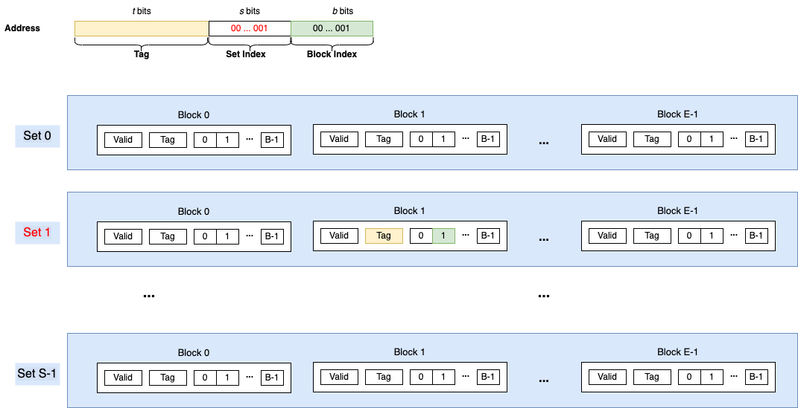

# Cache Lab

## Introduction
In this lab, we are going to work on two files:
```
csim.c       A Least-Recently Used(LRU) cache simulator
trans.c      A matrix transpose function to optimize cache behavior
```

## Task 1
In this task, we will implement an LRU cache simulator from scratch.  The input
is a polished version of valgrind trace file, having the format:
```
I 0400d7d4,8
 M 0421c7f0,4
 L 04f6b868,8
 S 7ff0005c8,8
```
Each line denotes one or two memory accesses. The format of each line is
```
[space]operation address,size
```
The operation field denotes the type of memory access: "I" denotes an instruction load,
"L" a data load, "S" a data store, and "M" a data modification. Each memory access may
affect the status of cache data. The following figure show the general organization of
cache memory.

Cache memory are divided to a number $S$ of sets. Each set consists of $E$ fixed-size
blocks. (or 'lines' in the textbook). Each block has a valid bit, a multi-bit tag field
and a data of $B$ bytes holding continuous memory address. An operation on a given address
, either load or store, will overwrite the block data that is mapped by current memory
address. The mapping between memory address and cache block parameters is based on a
segmentation of address bits.


## Task 2
In this task, we are going to optimize a matrix transpose function (e.g. B[M][N] = 
transpose(A[N][M])) in order to minimize the total amount of cache misses.
The performance are evaluated in three cases of different matric sizes, respectively (M=32, N=32), (M=64, N=64) and (M=61, N=67).
